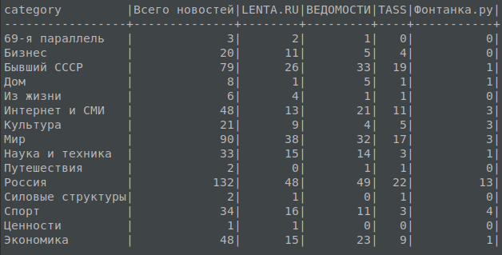
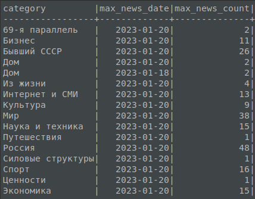
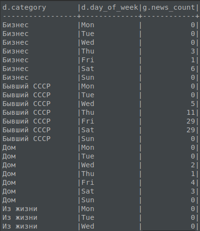

# Analysis of published news

<div align="center">


</div>

## Общая задача

Создать ETL-процесс формирования витрин данных для анализа публикаций новостей.<details>
   <summary>Detailed task description</summary>

- Develop data loading scripts in 2 modes:
     - Initializing - loading a full source data snapshot
     - Incremental - loading delta data for the past day

- Organize the correct data storage structure
     - Raw data layer
     - Intermediate layer
     - Data marts layer

As a result of the work of the software product, it is necessary to write a script that generates a data mart with the following content

- General part of data marts:
   - Category surrogate key
   - Name of category
- Data mart 1:
   - The total number of news from all sources in this category for all time
   - The number of news in this category for each of the sources for all time
- Data mart 2:
   - The total number of news from all sources for this category in the last 24 hours
   - The number of news in this category for each source in the last 24 hours
- Data mart 3:
   - Average number of publications in this category per day
   - The day on which the maximum number of publications in this category was made
- Data mart 4:
   - The number of news publications in this category by day of the week

**Addition**:

Because in different sources, the names and variety of categories may differ, you need to bring everything to a single look.

**Sources**:

- https://lenta.ru/rss/
- https://www.vedomosti.ru/rss/news
- https://tass.ru/rss/v2.xml

</details>

## Implementation plan


Let's bring everything to a single form. To do this, we will take as a basis the categories from the dataset [lenta.ru](https://github.com/yutkin/Lenta.Ru-News-Dataset/releases). Let's train the model and use the news headlines to determine their category.

Oozie runs the RSS parser once a day. Each news is assigned a category and the news is sent to Kafka.

Depending on the script mode (variable **data_loading_mode** in script **parser.py**), Spark either takes news from Kafka or from HBase, does additional transformations and saves them to HDFS, from where ClickHouse looks at them.

The final storefront is built in ClickHouse upon request.

My environment:

- [Hadoop 3.2.1](https://hadoop.apache.org/docs/stable/hadoop-project-dist/hadoop-common/SingleCluster.html#Pseudo-Distributed_Operation) - needed to organize a data lake based on HDFS.
- [Oozie 5.2.1](https://oozie.apache.org/docs/5.2.1/DG_QuickStart.html) - simple scheduler. More [instruction](https://www.cloudduggu.com/oozie/installation/) for installation.
- [Kafka 3.3.1](./kafka/) - no comments.
- [Spark 3.3.1](https://spark.apache.org/downloads.html) - fast data processing, better than MapReduce.
- [ClickHouse 22.11.2](https://clickhouse.com/docs/ru/getting-started/install/) - can be set to a folder in HDFS like in Hive Metastore. Makes quick selections.
- [HBase 2.5.2](https://hbase.apache.org/book.html#quickstart) - scalable database. More [instruction](https://kontext.tech/article/628/spark-connect-to-hbase) for installation. It is better to download [hbase-2.5.2-hadoop3-bin.tar.gz](https://dlcdn.apache.org/hbase/2.5.2/hbase-2.5.2-hadoop3-bin.tar.gz) to have all the necessary libraries.

## HDFS

### Initialization

```bash
hdfs namenode -format

start-dfs.sh

hdfs dfsadmin -safemode leave

hadoop fs -mkdir -p oozie/apps/ssh

hadoop fs -mkdir /news

# if you need to stop, then stop-dfs.sh
```

### Structure

```bash
├── news        # raw data as json files
└── user
  └── {user.name}
    └── oozie   # task files for oozie
```

## Oozie

Copy the **coordinator.xml** and **workflow.xml** files from the [oozie](./oozie/) folder to the HDFS folder **hdfs://localhost:9000/user/${user.name}/oozie/apps/ssh** and run job locally.

### Initialization

```bash
hadoop fs -put coordinator.xml oozie/apps/ssh
hadoop fs -put workflow.xml oozie/apps/ssh

oozied.sh start

# if you need to stop, then oozied.sh stop
```
### Run

```bash
oozie job -oozie http://localhost:11000/oozie -config ./job.properties -run
```

The running task can be seen at http://localhost:11000/oozie/ in the Coordinator Jobs tab


## Kafka

Let's deploy Kakfa using [docker-compose.yml](./kafka/docker-compose.yml). We will work with the topic **foobar**. Some commands that can be run on a kafka image from docker:

```bash
kafka-topics.sh --bootstrap-server localhost:9092 --list

kafka-console-consumer.sh --bootstrap-server localhost:9092 --topic foobar --from-beginning
```

## HBase

### HDFS initialization

```bash
./bin/start-all.sh
./bin/start-dfs.sh
./bin/start-yarn.sh
./bin/hdfs dfsadmin -safemode leave
```

### Starting HBase

```bash
$ ./bin/start-hbase.sh
$ ./bin/hbase thrift start
$ ./bin/hbase shell

hbase:001:0> create 'news', 'cf'
```

### Connector

Let's take [HBase connector](https://github.com/apache/hbase-connectors/tree/master/spark) as a connector.

First you need to collect it. Let's compile with the necessary versions:

```bash
mvn -Dspark.version=3.3.1 -Dscala.version=2.12.17 -Dscala.binary.version=2.12 -Dhbase.version=2.5.2 -Dhadoop.profile=3.0 -Dhadoop-three.version=3.2.1 -DskipTests -Dcheckstyle.skip -U clean package
```


## Spark

Depending on the **DATA_LOADING_MODE** variable, Spark will either run in bootstrap mode from the HBase table **news** or stream continuously from the Kafka topic **foobar**.

Saves data to the **hdfs:///news** folder every 10 seconds.

In parallel, the data is output to the console:


## ClickHouse

- **news** - news table
- **news_topic** - Kafka topic
- **news_target** - table from Kafka topic
- **vw_news** - materialized view


Initialization script [init.sql](./clickhouse/init.sql)

Final data marts scripts [result.sql](./clickhouse/result.sql)

## Development results

As a result, a project was created with the following structure:

```bash
├── clickhouse      # ClickHouse scripts
├── docs            # documentation
├── images          # diagrams, pictures
├── kafka           # Kafka scripts
├── lenta.ru        # category prediction model
├── oozie           # Oozie jobs
├── rss             # news parser
└── spark           # source code for Spark
```
<details>
  <summary>Data mart Examples</summary>

- Data marts 1, 2:

  

- Data mart 3:

  

- Data mart 4:

  

</details>