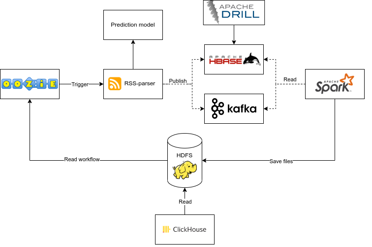
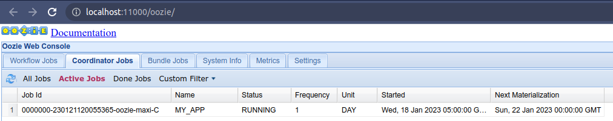
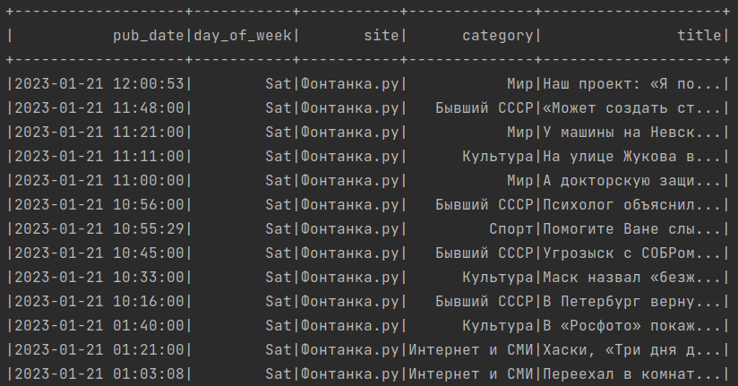
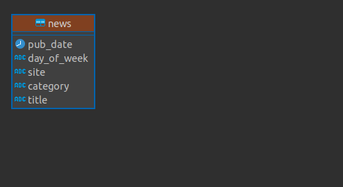

# Анализ публикуемых новостей

## Общая задача

Создать ETL-процесс формирования витрин данных для анализа публикаций новостей.

<details>
  <summary>Подробное описание задачи</summary>

- Разработать скрипты загрузки данных в 2-х режимах:
    - Инициализирующий – загрузка полного слепка данных источника
    - Инкрементальный – загрузка дельты данных за прошедшие сутки

- Организовать правильную структуру хранения данных
    - Сырой слой данных
    - Промежуточный слой
    - Слой витрин

В качестве результата работы программного продукта необходимо написать скрипт, который формирует витрину данных следующего содержания

- Суррогатный ключ категории
- Название категории
- Общее количество новостей из всех источников по данной категории за все время
- Количество новостей данной категории для каждого из источников за все время
- Общее количество новостей из всех источников по данной категории за последние сутки
- Количество новостей данной категории для каждого из источников за последние сутки
- Среднее количество публикаций по данной категории в сутки
- День, в который было сделано максимальное количество публикаций по данной категории
- Количество публикаций новостей данной категории по дням недели

**Дополнение**:

Т.к. в разных источниках названия и разнообразие категорий могут отличаться, вам необходимо привести все к единому виду.

**Источники**:

- https://lenta.ru/rss/
- https://www.vedomosti.ru/rss/news
- https://tass.ru/rss/v2.xml

</details>

## План реализации



Приведём все к единому виду. Для этого возьмём за основу категории из датасета [lenta.ru](https://github.com/yutkin/Lenta.Ru-News-Dataset/releases). Обучим модель и по заголовкам новостей будем определять их категорию.

Oozie запускает RSS-парсер один раз в день. Каждой новости сопоставляется категория, и новость отправляется в Kafka.

Spark берёт новости из Kafka, делает дополнительные преобразования и сохраняет их в HDFS, откуда на них смотрит ClickHouse.

Итоговая витрина строится в ClickHouse по запросу.

Моё окружение:

- [Hadoop 3.2.1](https://hadoop.apache.org/docs/stable/hadoop-project-dist/hadoop-common/SingleCluster.html#Pseudo-Distributed_Operation) - нужен для организации озера данных на основе HDFS. 
- [Oozie 5.2.1](https://oozie.apache.org/docs/5.2.1/DG_QuickStart.html) - простой планировщик. Ещё [инструкция](https://www.cloudduggu.com/oozie/installation/) по установке.
- [Kafka 3.3.1](./kafka/) - no comments.
- [Spark 3.3.1](https://spark.apache.org/downloads.html) - быстрая обработка данных, лучше чем MapReduce.
- [ClickHouse 22.11.2](https://clickhouse.com/docs/ru/getting-started/install/) - можно настроить на папку в HDFS как в Hive Metastore. Быстро делает выборки.

## HDFS

### Инициализация

```bash
hdfs namenode -format

start-dfs.sh

hdfs dfsadmin -safemode leave

hadoop fs -mkdir oozie
hadoop fs -mkdir oozie/apps
hadoop fs -mkdir oozie/apps/ssh

hadoop fs -mkdir /news

# если нужно остановить, то stop-dfs.sh
```

### Структура

```bash
├── news        # сырые данные в виде csv файлов
└── user
  └── {user.name}
    └── oozie   # файлы с задачами для oozie
```

## Oozie

Скопируем файлы **coordinator.xml** и **workflow.xml** из папки [oozie](./oozie/) в HDFS папку **hdfs://localhost:9000/user/${user.name}/oozie/apps/ssh** и локально запустим job.

### Инициализация

```bash
hadoop fs -put coordinator.xml oozie/apps/ssh
hadoop fs -put workflow.xml oozie/apps/ssh

oozied.sh start

# если нужно остановить, то oozied.sh stop
```
### Запуск

```bash
oozie job -oozie http://localhost:11000/oozie -config ./job.properties -run
```

Запущенную задачу можно увидеть по адресу http://localhost:11000/oozie/ во вкладке Coordinator Jobs



## Kafka

Kakfa развернём с помощью [docker-compose.yml](./kafka/docker-compose.yml). Работать будем с топиком **foobar**. Некоторые команды, которые можно запустить на образе kafka из docker:

```bash
kafka-topics.sh --bootstrap-server localhost:9092 --list

kafka-console-consumer.sh --bootstrap-server localhost:9092 --topic foobar --from-beginning
```

## Spark

Spark всегда запущен и в режиме реального времени получает данные из Kafka топика **foobar**.

Сохраняет данные в папку **hdfs:///news** каждые 10 секунд в формате csv.

Параллельно данные выводятся в консоль:



## ClickHouse

## Структура БД
- **news** - таблица с новостями



Скрипт иницилизации [init.sql](./clickhouse/init.sql).

## Результаты разработки

В результате был создан проект со следующей структурой:

```bash
├── clickhouse      # скрипты для ClickHouse
├── docs            # документация, презентация
├── images          # диаграммы, картинки
├── kafka           # скрипты для Kafka
├── lenta.ru        # модель для предсказания категории
├── oozie           # задачи для Oozie
├── rss             # парсер новостей
└── spark           # исходный код для Spark
```
Пример витрины данных: